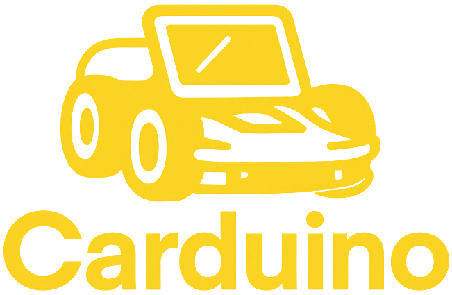

##

****

## Purpose and Benefits

### Purpose

The Carduino is aimed at giving people an affordable option for a remote control car that does not require you to buy expensive car kits, while still keeping the core mechanics of a remote control car. Just like any other car, you can still view the speed, distance travelled and the temperature of your car. All of this will help you keep track of your car's wellbeing and ensure it's longevity. We have also integrated a few desirable features, such as brake lights and music which lets you drive the car while listening to some nice songs, alternatively, you can also honk if you wish to let someone know of your presence!

### Benefits

The benefits of this car can be summed up as follows;

* Affordable Remote Control Car
* Sensors to ensure the cars wellbeing and track its performance
* Desirable additions such as lights that helps the car be seen in traffic
* Power preservation through automatically turning off the car
* Automatic stop upon losing internet to avoid losing your car

## Hardware and Software Architecture

### Hardware Architecture

The hardware is composed of the Wio Terminal which is the heart of the car. The Wio is connected to both sensors and actuators. The Wio is also connected to the internet to access the MQTT broker which lets it send sensor values and receive orders for the actuators.

The Wio Terminal has the following sensors and actuators:

#### Sensors

Accelerometer (Built in)

Temperature Sensor (Addon)

#### Actuators

4 x DC Motors (Addon)

Buzzer (Built in)

Chainable LED (Addon)

### Software Architecture

The Web App and Wio Terminal are connected through an online broker. The web app is subscribed to the sensor values that the Wio Terminal publishes and it will display it on the controls page.

Likewise, the arduino is subscribed to changes to the actuators and when the control page of the web app is interacted with, the arduino will receive a command that will be executed by the Wio. The web app gives you a varying level of control, for example, the LEDs only give you the option of having brake lights enabled or not. The motors, however, let you control the direction of the car as you wish. Likewise, the buzzer allows you to play any tune in our list whenever you wish to do so.

#### Diagram

If you wish to view a detailed diagram of the architecture of the project, you can view it in our [wiki](https://git.chalmers.se/courses/dit113/2025/group-11/carduino/-/wikis/System-Architecture-Diagram)

## Setup Instructions

To set up the carduino, you have to first plug in all the cables for the sensors as follows;

The LEDs need to be plugged into A0 and A1.

The temperature sensor needs to be plugged into A2.

The motors need to be set up as follows: 

The left motor in the back needs to be hooked up to D5

The left motor in the front needs to be hooked up to D6

The right motor in the front needs to be hooked up to D7

The right motor in the back needs to be hooked up to D8

Afterwards you need to update the internet credentials in the arduino file main.ino on line 16 and 17. If you are using a public wifi and it does not work, try to change your wifi to a private one, or change to cellular.

Then you need to download the dependencies for the arduino from the shellscript named setup-build-env.sh.
Now you are ready to upload the code to the Wio Terminal! Simply open up the Arduino IDE, plug in the Wio Terminal and click on upload.

Now that the Wio Terminal is set up you should set up the web page.
This is a short process compared to the hardware components. All you need to do is to open up cmd, navigate to the Web_App folder, and write:

`npm install`

`npm run dev`

`o`

and the webpage should be opened up!

### Problems

Some problems might occur with the MQTT connection. Keep in mind, this is not a hardware issue. This is a broker issue, so to resolve this issue, you should change the broker in Arduino/main/main.ino on line 23 and in Web_App/src/client.js you need to change the broker on line 40.
You could use the following public brokers:

broker.hivemq.com

test.mosquttio.org

However, there are always certain risks with using public brokers, if you wish to use a secure private broker, please open up a local broker on your own computer or get a private online broker.

## Contributions

This project has had 5 contributors. Their names are and contributions are:

#### Makan Ajdadi Salekdeh

Set up the motors and movement of the car.

#### Ali Parham Ashrafzadeh

Set up the lights and power preservation of the car.

#### Dorin Calmis

Set up the diagnostics history of the car and the music buzzer. Set up MQTT connection for the Hardware.

#### Sivert Bronebakk

Set up the diagnostics sensors for the car

#### Mobin Salehi

Set up music buzzer and MQTT component in the Vue project

## Demo Video

Our video demo can be viewed [here](https://youtube.com/shorts/KBUjil1v-F0?feature=share)

